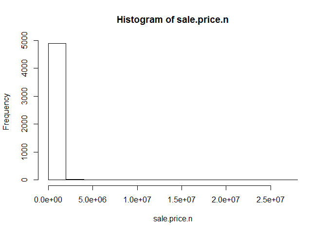
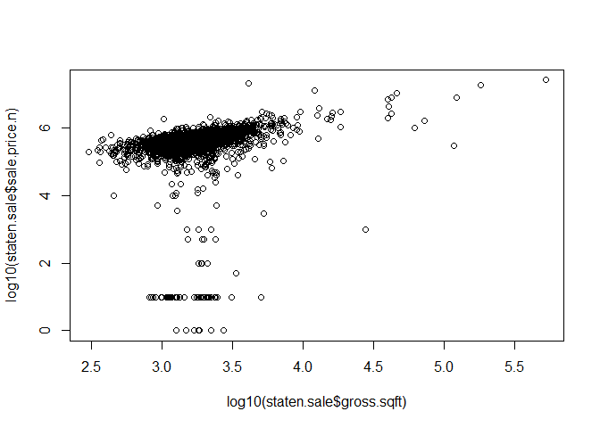
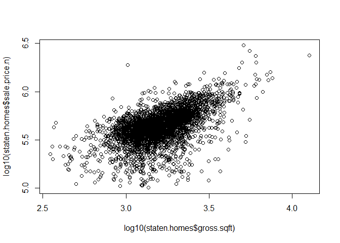
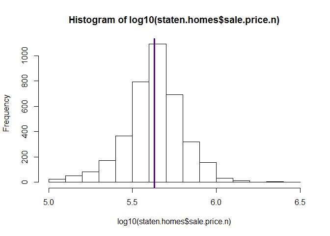

# RollingSales_StatenIsland
Sandhya,Aravind,Mamadou  
June 5, 2016  

##This R markdown is created to demonstrate Collaboration and Versioning as explained in Unit 4.This group project involves working on a data set to analyze the real estate property prices in Staten Island and develop meaningful insights about the sale price of Family Dwellings.


```r
#First Start off by by loading the Plyr Library
## It is and R package that allows easy manipulation of large data set  by manipulating data values and putting it back together.
library(plyr)
```

```
## Warning: package 'plyr' was built under R version 3.2.5
```

```r
#Next step is to create a new R Project and setting the working directory to a directory/folder on your local machine Where the Project files will be organized.
setwd("C:\\Users\\samaresh\\SMU\\Doing Datascience\\week4\\RollingSales_StatenIsland")
#Read the Staten Island data file after saving it as a csv
staten <- read.csv("Data/rollingsales_statenisland.csv",skip=4,header=TRUE)
#Exploratory data analysis by looking at the summary data 
head(staten)
```

```
##   BOROUGH              NEIGHBORHOOD
## 1       5 ANNADALE                 
## 2       5 ANNADALE                 
## 3       5 ANNADALE                 
## 4       5 ANNADALE                 
## 5       5 ANNADALE                 
## 6       5 ANNADALE                 
##                        BUILDING.CLASS.CATEGORY TAX.CLASS.AT.PRESENT BLOCK
## 1 01  ONE FAMILY DWELLINGS                                        1  5394
## 2 01  ONE FAMILY DWELLINGS                                        1  5397
## 3 01  ONE FAMILY DWELLINGS                                        1  5401
## 4 01  ONE FAMILY DWELLINGS                                        1  5401
## 5 01  ONE FAMILY DWELLINGS                                        1  5402
## 6 01  ONE FAMILY DWELLINGS                                        1  5404
##   LOT EASE.MENT BUILDING.CLASS.AT.PRESENT
## 1   4                                  A2
## 2  51                                  A1
## 3   5                                  A2
## 4  33                                  A1
## 5  43                                  A1
## 6  46                                  A1
##                                     ADDRESS APARTMENT.NUMBER ZIP.CODE
## 1 26 FINGAL STREET                                              10312
## 2 23 EYLANDT STREET                                             10312
## 3 28 JANSEN STREET                                              10312
## 4 17 WEAVER STREET                                              10312
## 5 295 HAROLD AVENUE                                             10312
## 6 119 LENZIE STREET                                             10312
##   RESIDENTIAL.UNITS COMMERCIAL.UNITS TOTAL.UNITS LAND.SQUARE.FEET
## 1                 1                0           1            13406
## 2                 1                0           1            10120
## 3                 1                0           1            10800
## 4                 1                0           1            11000
## 5                 1                0           1             6700
## 6                 1                0           1             8000
##   GROSS.SQUARE.FEET YEAR.BUILT TAX.CLASS.AT.TIME.OF.SALE
## 1              4180       1982                         1
## 2              3000       1985                         1
## 3              2164       1980                         1
## 4              3214       1980                         1
## 5              3348       1980                         1
## 6              3660       1998                         1
##   BUILDING.CLASS.AT.TIME.OF.SALE   SALE.PRICE  SALE.DATE
## 1                             A2  $1,199,000   8/26/2015
## 2                             A1    $955,000  12/18/2015
## 3                             A2        $-     12/1/2015
## 4                             A1    $915,000   1/15/2016
## 5                             A1        $-     7/27/2015
## 6                             A1        $-     9/16/2015
```

```r
summary(staten)
```

```
##     BOROUGH                         NEIGHBORHOOD  
##  Min.   :5                                :13375  
##  1st Qu.:5       GREAT KILLS              :  562  
##  Median :5       NEW SPRINGVILLE          :  364  
##  Mean   :5       MIDLAND BEACH            :  358  
##  3rd Qu.:5       ELTINGVILLE              :  293  
##  Max.   :5       BULLS HEAD               :  276  
##  NA's   :13375   (Other)                  : 4885  
##                                  BUILDING.CLASS.CATEGORY
##                                              :13375     
##  01  ONE FAMILY DWELLINGS                    : 3870     
##  02  TWO FAMILY DWELLINGS                    : 1432     
##  04  TAX CLASS 1 CONDOS                      :  402     
##  05  TAX CLASS 1 VACANT LAND                 :  257     
##  13  CONDOS - ELEVATOR APARTMENTS            :  178     
##  (Other)                                     :  599     
##  TAX.CLASS.AT.PRESENT     BLOCK            LOT         EASE.MENT
##         :13375        Min.   :   1    Min.   :   1.0    :13375  
##  1      : 5379        1st Qu.:1048    1st Qu.:  24.0    : 6737  
##  1A     :  402        Median :3152    Median :  54.0   E:    1  
##  2      :  335        Mean   :3306    Mean   : 197.8            
##  4      :  308        3rd Qu.:5401    3rd Qu.: 130.0            
##  1B     :  263        Max.   :8050    Max.   :7515.0            
##  (Other):   51        NA's   :13375   NA's   :13375             
##  BUILDING.CLASS.AT.PRESENT
##         :13375            
##  A5     : 1471            
##  A1     : 1140            
##  B2     :  949            
##  A2     :  763            
##  R3     :  402            
##  (Other): 2013            
##                                       ADDRESS          APARTMENT.NUMBER
##                                           :13375               :13375  
##  90 BAY STREET LANDING                    :   58               : 6323  
##  2 ELMWOOD PARK DRIVE                     :   15   2           :    9  
##  282 LAMBERTS LANE                        :   14   1           :    8  
##  145 LINCOLN AVENUE                       :   13   1A          :    7  
##  55 AUSTIN PLACE                          :   11   1B          :    7  
##  (Other)                                  : 6627   (Other)     :  384  
##     ZIP.CODE     RESIDENTIAL.UNITS COMMERCIAL.UNITS  TOTAL.UNITS     
##  Min.   :    0   Min.   :  0.000   Min.   : 0.000   Min.   :  0.000  
##  1st Qu.:10305   1st Qu.:  1.000   1st Qu.: 0.000   1st Qu.:  1.000  
##  Median :10308   Median :  1.000   Median : 0.000   Median :  1.000  
##  Mean   :10259   Mean   :  1.429   Mean   : 0.065   Mean   :  1.494  
##  3rd Qu.:10312   3rd Qu.:  1.000   3rd Qu.: 0.000   3rd Qu.:  1.000  
##  Max.   :10314   Max.   :454.000   Max.   :43.000   Max.   :454.000  
##  NA's   :13375   NA's   :13375     NA's   :13375    NA's   :13375    
##  LAND.SQUARE.FEET GROSS.SQUARE.FEET   YEAR.BUILT   
##  Min.   :     0   Min.   :     0    Min.   :   0   
##  1st Qu.:  2000   1st Qu.:  1000    1st Qu.:1935   
##  Median :  3330   Median :  1440    Median :1970   
##  Mean   :  5184   Mean   :  1965    Mean   :1860   
##  3rd Qu.:  4828   3rd Qu.:  2038    3rd Qu.:1988   
##  Max.   :971453   Max.   :524513    Max.   :2015   
##  NA's   :13375    NA's   :13375     NA's   :13375  
##  TAX.CLASS.AT.TIME.OF.SALE BUILDING.CLASS.AT.TIME.OF.SALE
##  Min.   :1.000                    :13375                 
##  1st Qu.:1.000             A5     : 1459                 
##  Median :1.000             A1     : 1146                 
##  Mean   :1.197             B2     :  938                 
##  3rd Qu.:1.000             A2     :  781                 
##  Max.   :4.000             R3     :  402                 
##  NA's   :13375             (Other): 2012                 
##       SALE.PRICE         SALE.DATE    
##            :13375             :13375  
##   $-       : 1828   9/30/2015 :   66  
##   $350,000 :   82   6/25/2015 :   65  
##   $400,000 :   65   10/15/2015:   53  
##   $10      :   59   7/29/2015 :   52  
##   $420,000 :   52   6/30/2015 :   51  
##  (Other)   : 4652   (Other)   : 6451
```

```r
str(staten)
```

```
## 'data.frame':	20113 obs. of  21 variables:
##  $ BOROUGH                       : int  5 5 5 5 5 5 5 5 5 5 ...
##  $ NEIGHBORHOOD                  : Factor w/ 59 levels "","ANNADALE                 ",..: 2 2 2 2 2 2 2 2 2 2 ...
##  $ BUILDING.CLASS.CATEGORY       : Factor w/ 34 levels "","01  ONE FAMILY DWELLINGS                    ",..: 2 2 2 2 2 2 2 2 2 2 ...
##  $ TAX.CLASS.AT.PRESENT          : Factor w/ 9 levels "","1","1A","1B",..: 2 2 2 2 2 2 2 2 2 2 ...
##  $ BLOCK                         : int  5394 5397 5401 5401 5402 5404 5405 5406 5425 5425 ...
##  $ LOT                           : int  4 51 5 33 43 46 47 36 34 45 ...
##  $ EASE.MENT                     : Factor w/ 3 levels ""," ","E": 2 2 2 2 2 2 2 2 2 2 ...
##  $ BUILDING.CLASS.AT.PRESENT     : Factor w/ 86 levels "","A0","A1","A2",..: 4 3 4 3 3 3 4 3 7 3 ...
##  $ ADDRESS                       : Factor w/ 6168 levels "","1 ALBION PLACE                           ",..: 2483 2127 2688 1326 2823 446 3437 198 273 3466 ...
##  $ APARTMENT.NUMBER              : Factor w/ 267 levels "","            ",..: 2 2 2 2 2 2 2 2 2 2 ...
##  $ ZIP.CODE                      : int  10312 10312 10312 10312 10312 10312 10312 10312 10312 10312 ...
##  $ RESIDENTIAL.UNITS             : int  1 1 1 1 1 1 1 1 1 1 ...
##  $ COMMERCIAL.UNITS              : int  0 0 0 0 0 0 0 0 0 0 ...
##  $ TOTAL.UNITS                   : int  1 1 1 1 1 1 1 1 1 1 ...
##  $ LAND.SQUARE.FEET              : int  13406 10120 10800 11000 6700 8000 9800 2500 2500 5000 ...
##  $ GROSS.SQUARE.FEET             : int  4180 3000 2164 3214 3348 3660 1785 1200 448 1483 ...
##  $ YEAR.BUILT                    : int  1982 1985 1980 1980 1980 1998 1980 1999 1910 1910 ...
##  $ TAX.CLASS.AT.TIME.OF.SALE     : int  1 1 1 1 1 1 1 1 1 1 ...
##  $ BUILDING.CLASS.AT.TIME.OF.SALE: Factor w/ 86 levels "","A0","A1","A2",..: 4 3 4 3 3 3 4 3 7 3 ...
##  $ SALE.PRICE                    : Factor w/ 1430 levels ""," $-   "," $1 ",..: 29 1409 2 1391 2 2 2 925 142 620 ...
##  $ SALE.DATE                     : Factor w/ 292 levels "","1/10/2016",..: 256 87 80 7 227 274 3 276 174 84 ...
```

```r
#Data Cleanup to eliminate spaces and getting rid of leading digits
staten$SALE.PRICE.N <- as.numeric(gsub("[^[:digit:]]","", staten$SALE.PRICE))
count(is.na(staten$SALE.PRICE.N))
```

```
##       x  freq
## 1 FALSE  4910
## 2  TRUE 15203
```

```r
names(staten) <- tolower(names(staten)) # make all variable names lower case
staten$gross.sqft <- as.numeric(gsub("[^[:digit:]]","", staten$gross.square.feet))
staten$land.sqft <- as.numeric(gsub("[^[:digit:]]","", staten$land.square.feet))
staten$year.built <- as.numeric(as.character(staten$year.built))

## analysing the subject of interest which is the Sales Price
attach(staten)
hist(sale.price.n) 
```

<!-- -->

```r
detach(staten)

## Eliminate all the 0$ sales
staten.sale <- staten[staten$sale.price.n!=0,]
## Plot the Sqft vs Sales Price
plot(staten.sale$gross.sqft,staten.sale$sale.price.n)
```

<!-- -->

```r
## Since the graph is right skewed we will do a log transformation
plot(log10(staten.sale$gross.sqft),log10(staten.sale$sale.price.n))
```

<!-- -->

```r
## Analysing sale price of family dwellings
staten.homes <- staten.sale[which(grepl("FAMILY",staten.sale$building.class.category)),]
dim(staten.homes)
```

```
## [1] 3933   24
```

```r
## Plot the Sqft vs Sales Price for family dwellings after log transformation
plot(log10(staten.homes$gross.sqft),log10(staten.homes$sale.price.n))
```

<!-- -->

```r
##Analyse the outliers
summary(staten.homes[which(staten.homes$sale.price.n<100000),])
```

```
##     borough                     neighborhood
##  Min.   :5   PORT RICHMOND            :13   
##  1st Qu.:5   ELTINGVILLE              :10   
##  Median :5   GREAT KILLS              : 8   
##  Mean   :5   ROSEBANK                 : 8   
##  3rd Qu.:5   MIDLAND BEACH            : 7   
##  Max.   :5   NEW BRIGHTON             : 7   
##              (Other)                  :73   
##                                  building.class.category
##  01  ONE FAMILY DWELLINGS                    :88        
##  02  TWO FAMILY DWELLINGS                    :35        
##  03  THREE FAMILY DWELLINGS                  : 3        
##                                              : 0        
##  04  TAX CLASS 1 CONDOS                      : 0        
##  05  TAX CLASS 1 VACANT LAND                 : 0        
##  (Other)                                     : 0        
##  tax.class.at.present     block           lot        ease.ment
##  1      :126          Min.   :  39   Min.   :  1.0    :  0    
##         :  0          1st Qu.: 760   1st Qu.: 22.5    :126    
##  1A     :  0          Median :2326   Median : 48.0   E:  0    
##  1B     :  0          Mean   :2861   Mean   : 81.3            
##  2      :  0          3rd Qu.:5014   3rd Qu.:105.5            
##  2A     :  0          Max.   :8046   Max.   :516.0            
##  (Other):  0                                                  
##  building.class.at.present                                      address   
##  A5     :29                36 INNIS STREET                          :  3  
##  A1     :27                291 DEEMS AVENUE                         :  2  
##  B2     :26                5 AVENUE B                               :  2  
##  A2     :19                631 VAN DUZER STREET                     :  2  
##  A9     : 7                87 CRESCENT AVENUE                       :  2  
##  A6     : 5                100 LOCKMAN AVENUE                       :  1  
##  (Other):13                (Other)                                  :114  
##      apartment.number    zip.code     residential.units commercial.units  
##              :126     Min.   :10301   Min.   :1.000     Min.   :0.000000  
##              :  0     1st Qu.:10303   1st Qu.:1.000     1st Qu.:0.000000  
##  01-B        :  0     Median :10306   Median :1.000     Median :0.000000  
##  01-C        :  0     Mean   :10307   Mean   :1.325     Mean   :0.007937  
##  02-B        :  0     3rd Qu.:10312   3rd Qu.:2.000     3rd Qu.:0.000000  
##  02-C        :  0     Max.   :10314   Max.   :3.000     Max.   :1.000000  
##  (Other)     :  0                                                         
##   total.units    land.square.feet gross.square.feet   year.built  
##  Min.   :1.000   Min.   :  640    Min.   : 360      Min.   :1899  
##  1st Qu.:1.000   1st Qu.: 2500    1st Qu.:1152      1st Qu.:1925  
##  Median :1.000   Median : 3212    Median :1500      Median :1958  
##  Mean   :1.333   Mean   : 3856    Mean   :1603      Mean   :1954  
##  3rd Qu.:2.000   3rd Qu.: 4522    3rd Qu.:2019      3rd Qu.:1978  
##  Max.   :3.000   Max.   :16530    Max.   :3438      Max.   :2010  
##                                                                   
##  tax.class.at.time.of.sale building.class.at.time.of.sale     sale.price
##  Min.   :1                 A5     :29                      $10     :53  
##  1st Qu.:1                 A1     :27                      $1      : 7  
##  Median :1                 B2     :26                      $50,000 : 6  
##  Mean   :1                 A2     :19                      $100    : 5  
##  3rd Qu.:1                 A9     : 7                      $70,000 : 5  
##  Max.   :1                 A6     : 5                      $500    : 4  
##                            (Other):13                     (Other)  :46  
##       sale.date    sale.price.n     gross.sqft     land.sqft    
##  10/27/2015:  4   Min.   :    1   Min.   : 360   Min.   :  640  
##  1/14/2016 :  3   1st Qu.:   10   1st Qu.:1152   1st Qu.: 2500  
##  10/29/2015:  3   Median :  100   Median :1500   Median : 3212  
##  10/30/2015:  3   Mean   :23249   Mean   :1603   Mean   : 3856  
##  5/22/2015 :  3   3rd Qu.:50000   3rd Qu.:2019   3rd Qu.: 4522  
##  6/18/2015 :  3   Max.   :95000   Max.   :3438   Max.   :16530  
##  (Other)   :107
```

```r
## outliers that seem like they weren't actual sales
staten.homes$outliers <- (log10(staten.homes$sale.price.n) <=5) + 0
## remove outliers that seem like they weren't actual sales
staten.homes <- staten.homes[which(staten.homes$outliers==0),]
## plot the sqft vs sales price for family dwellings above 100K
plot(log(staten.homes$gross.sqft),log(staten.homes$sale.price.n))
```

<!-- -->

```r
##Histogram to analyse the sales price for family dwellings after removing outliers 
hist(staten.homes$sale.price.n)
```

<!-- -->

```r
##Histogram to analyse the sales price for family dwellings after removing outliers after log transformation as the above is right skewed
hist(log10(staten.homes$sale.price.n))
#display the mean sale price and mark it on the histogram in blue
mx <-  mean(log10(staten.homes$sale.price.n))
abline(v = mx, col = "blue", lwd = 2)
#display the mean sale price and mark it on the histogram in red
medx <- median(log10(staten.homes$sale.price.n))
abline(v = medx, col = "red", lwd = 0.1)
```

<!-- -->

